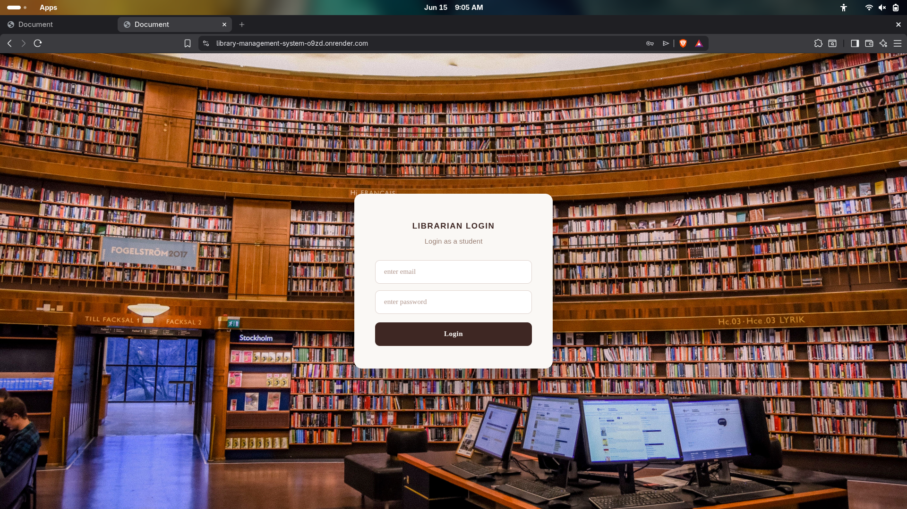
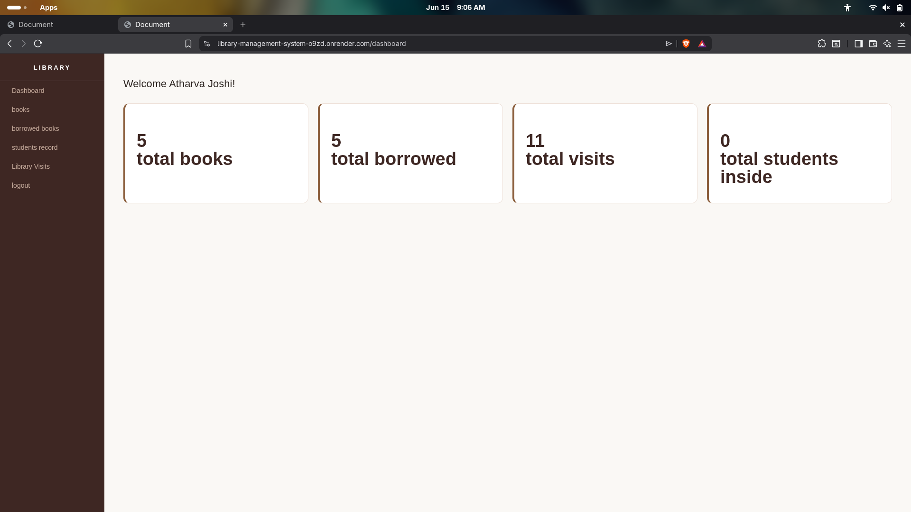
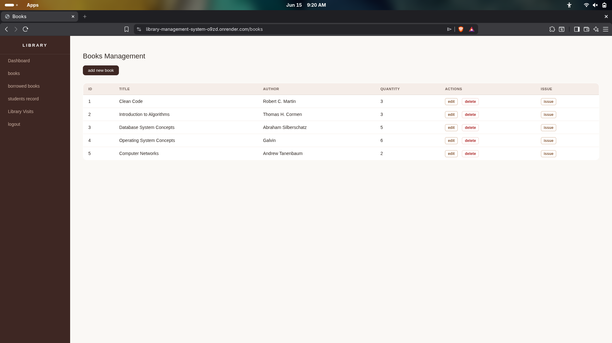
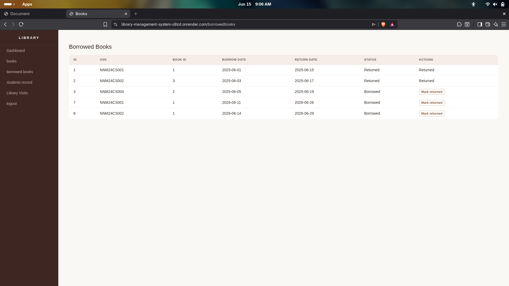
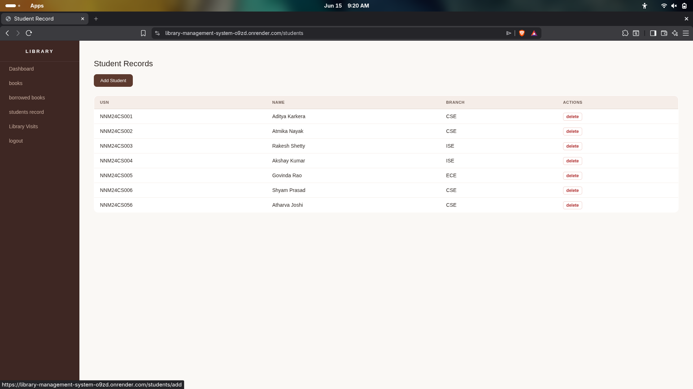
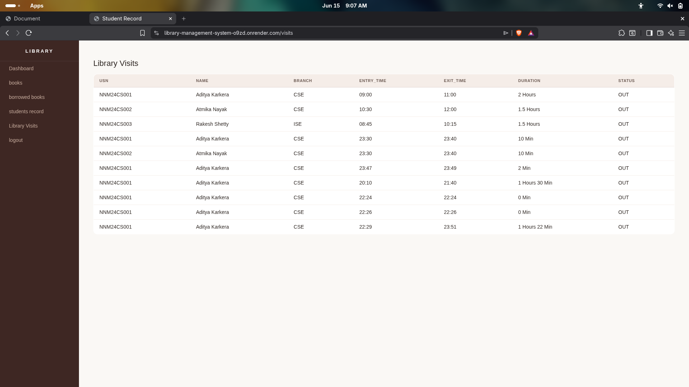
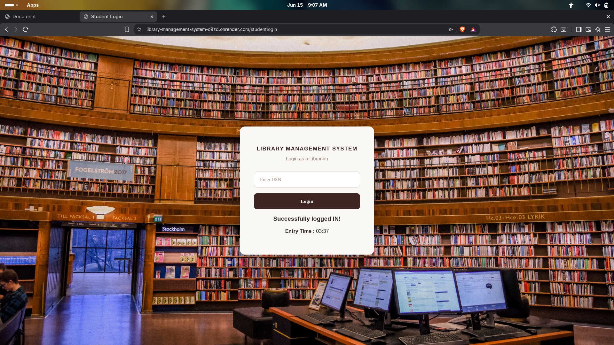

# 📚 Library Management System

A full-stack Library Management System built using **Node.js**, **Express.js**, **SQLite3**, **EJS**, and **Express Session**. The system allows librarians to manage books, students, borrowing records, and library visit tracking through an intuitive web interface.


---

##  Live Demo

**Deployed Application:**  
https://library-management-system-o9zd.onrender.com

---

##  Features

###  Librarian Authentication
- Secure login system
- Session-based authentication
- Protected routes
- Logout functionality

###  Book Management
- Add new books
- Edit existing books
- Delete books
- View all books
- Track available quantity

###  Student Management
- Add new students
- View student records
- Delete students
- Manage student information using USN

###  Book Borrowing System
- Issue books to students
- Automatic return date generation
- Prevent duplicate book issues
- Mark books as returned
- Automatic quantity updates

###  Library Visit Tracking
- Student entry registration
- Student exit registration
- Automatic duration calculation
- Real-time visitor tracking
- Complete visit history

###  Dashboard Analytics
Displays:
- Total Books
- Total Borrowed Books
- Total Library Visits
- Students Currently Inside Library

---

## 🛠️ Tech Stack

| Technology | Usage |
|------------|--------|
| Node.js | Backend Runtime |
| Express.js | Server Framework |
| SQLite3 | Database |
| EJS | Template Engine |
| Express Session | Authentication |
| HTML/CSS | Frontend UI |

---

## 📷 Screenshots

### Login Page



### Dashboard



### Books Management



### Borrowed Books



### Student Records



### Library Visits



### Student Login Portal



---

## 🗄️ Database Schema

### LIBRARIANS

| Column | Type |
|----------|----------|
| id | INTEGER (PK) |
| name | TEXT |
| email | TEXT |
| password | TEXT |

---

### STUDENTS

| Column | Type |
|----------|----------|
| usn | TEXT (PK) |
| name | TEXT |
| branch | TEXT |

---

### BOOKS

| Column | Type |
|----------|----------|
| id | INTEGER (PK) |
| title | TEXT |
| author | TEXT |
| quantity | INTEGER |

---

### BORROWEDBOOKS

| Column | Type |
|----------|----------|
| id | INTEGER (PK) |
| usn | TEXT |
| bookid | INTEGER |
| borrow_date | DATE |
| return_date | DATE |
| status | TEXT |

---

### LIBRARYVISITS

| Column | Type |
|----------|----------|
| id | INTEGER (PK) |
| usn | TEXT |
| entry_time | TEXT |
| exit_time | TEXT |
| duration | TEXT |
| status | TEXT |

---

## 📂 Project Structure

```text
library-management-system
│
├── public
│   ├── style.css
│   └── hero.png
│
├── views
│   ├── login.ejs
│   ├── dashboard.ejs
│   ├── books.ejs
│   ├── addbook.ejs
│   ├── editbook.ejs
│   ├── borrowedbooks.ejs
│   ├── studentrecord.ejs
│   ├── addstudent.ejs
│   ├── issueform.ejs
│   ├── studentlogin.ejs
│   └── libraryvisits.ejs
│
├── app.js
├── db.js
├── library.db
├── package.json
├── .env
└── README.md
```

---

## ⚙️ Installation

### Clone Repository

```bash
git clone https://github.com/atharvaajoshii/Library-management-system.git
cd Library-management-system
```

### Install Dependencies

```bash
npm install
```

### Create Environment File

Create a `.env` file in the root directory:

```env
SESSION_SECRET=your_secret_key
PORT=5002
```

### Run Application

```bash
node app.js
```

or

```bash
nodemon app.js
```

---

##  Default Librarian Credentials

```text
Email: atharva@gmail.com
Password: pass123
```

> Change these credentials before deploying to production.

---

## 🛣️ Routes

### Authentication

| Method | Route |
|----------|----------|
| GET | / |
| POST | /login |
| GET | /logout |

### Dashboard

| Method | Route |
|----------|----------|
| GET | /dashboard |

### Books

| Method | Route |
|----------|----------|
| GET | /books |
| GET | /books/add |
| POST | /books/add |
| GET | /books/edit/:id |
| POST | /books/edit/:id |
| GET | /books/delete/:id |

### Students

| Method | Route |
|----------|----------|
| GET | /students |
| GET | /students/add |
| POST | /students/add |
| GET | /student/delete/:usn |

### Borrowed Books

| Method | Route |
|----------|----------|
| GET | /borrowedbooks |
| GET | /books/issue/:bookid |
| POST | /books/issue/:bookid |
| GET | /borrowedbooks/returned/:usn/:bookid |

### Library Visits

| Method | Route |
|----------|----------|
| GET | /studentlogin |
| POST | /studentlogin |
| GET | /visits |

---

## 🔄 Library Visit Workflow

### Student Entry

1. Student enters USN.
2. System validates student record.
3. Entry time is recorded.
4. Status changes to **IN**.

### Student Exit

1. Student enters the same USN.
2. Latest visit record is fetched.
3. Exit time is recorded.
4. Duration is calculated automatically.
5. Status changes to **OUT**.

---

## Future Enhancements

- Password hashing using bcrypt
- Search and filter functionality
- Fine calculation for overdue books
- QR Code based student entry
- Email notifications
- Admin analytics dashboard
- Export reports as PDF/Excel
- Book reservation system
- Multi-librarian roles

---

##  Author

### Atharva Joshi

Computer Science Student & Full Stack Developer

GitHub:  
https://github.com/atharvaajoshii

---

##  Support

If you found this project useful, consider giving it a star ⭐ on GitHub.

---
